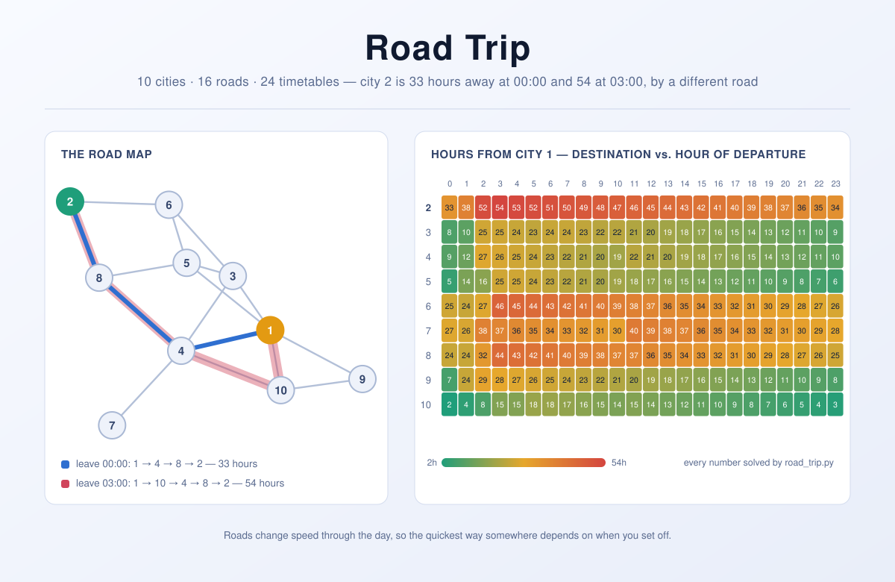

road-trip
=========

A shortest-path puzzle in which the map holds still and the clock does not: every
road takes a different number of hours depending on what time of day you set off
along it.

What stops this being an ordinary Dijkstra exercise is that a road's cost is not
a number but a table of twenty-four, so the fastest route can change shape as the
day goes on — in the ten-city network on the banner below, city 2 is best reached
through city 4 if you leave at midnight and through city 10 if you leave at
three, and the later journey takes 54 hours where the earlier one took 33. What stops it being
intractable is a single line buried in the limits, `Cost[t] <= Cost[t+1] + 1`,
which quietly promises that leaving later never gets you there earlier. That
promise is worth far more than it looks: it means waiting around is never worth
doing, that a prefix of a fastest route is itself a fastest route, and therefore
that plain Dijkstra is still correct — provided the number it settles on is the
hour of arrival rather than a sum of fixed weights. This repository keeps a
second, slower solver that reaches the same answers by brute repeated relaxation,
because two independent implementations agreeing on 27 190 answers is a better
argument than a paragraph of reasoning, this one included.

<picture>
  <source media="(prefers-color-scheme: dark)" srcset="docs/banner-dark.svg">
  
</picture>

*(The banner is not decoration: the map, both traced routes and all 216 numbers
in the grid come from running the solver in this repository on case 29 of
`data/small-input.in`, so the picture is the answer. Note the diagonal grain of
the grid: across most of the day each number falls by exactly one per column, so
an hour's delay buys back an hour of driving and Peter arrives at the very same
o'clock whenever he leaves. That is `Cost[t] <= Cost[t+1] + 1` holding with
equality — the FIFO guarantee pulled taut.)*

## Problem definition

There are **N** cities in Peter's state (numbered from 1, which is Peter's city),
and **M** bidirectional roads directly connect them. A pair of cities may be
connected by more than one road. Because of changes in traffic patterns, it may
take different amounts of time to use a road at different times of day, depending
on when the journey starts — but the direction travelled does not matter, as
traffic is always equally bad both ways. All trips on a road start and end exactly
on the hour, and a trip on one road can be started instantaneously after finishing
a trip on another.

Peter is deciding where to go for his summer holiday. He wonders how quickly he
can get from his city to various destinations, depending on what time he leaves.
His route may pass through intermediate cities on the way. Answer all his
questions.

### Input

The first line gives the number of test cases, **T**. **T** test cases follow.

The first line of each test case contains three integers: the number **N** of
cities, the number **M** of roads, and the number **K** of Peter's questions.

Then come 2M lines — M pairs. In each pair, the first line holds two different
integers *x* and *y* describing one bidirectional road between city *x* and city
*y*. The second holds **24** integers `Cost[t] (0 <= t <= 23)`, the time cost in
hours of using that road when departing at *t* o'clock. It is guaranteed that
`Cost[t] <= Cost[t+1] + 1` for `0 <= t <= 22`, and that `Cost[23] <= Cost[0] + 1`.

Then **K** lines follow, each holding two integers **D** and **S**: what is the
fewest number of hours it takes to get from city 1 to city **D**, if Peter departs
city 1 at **S** o'clock?

### Output

For each test case, output one line containing `"Case #x: "`, where x is the case
number starting from 1, followed by **K** space-separated integers — the answers
to the questions, in order. If Peter cannot reach the destination city for a
question, no matter which roads he takes, output `-1` for that question.

### Limits

```
1 <= x, y <= N.
1 <= all Cost values <= 50.
1 <= D <= N.
0 <= S <= 23.
```

| | Small dataset | Large dataset |
| --- | --- | --- |
| **T** | `1 <= T <= 100` | `1 <= T <= 5` |
| **N** | `2 <= N <= 20` | `2 <= N <= 500` |
| **M** | `1 <= M <= 100` | `1 <= M <= 2000` |
| **K** | `1 <= K <= 100` | `1 <= K <= 5000` |

Both datasets ship with the repository, in `data/`. The small one is 100 cases and
4 592 questions; the large one is 5 cases, up to 495 cities and 1 957 roads
apiece, and 22 598 questions.

### Sample

`data/sample.in`, the worked example from the original statement, with the
expected output in `data/sample.out`:

```
$ python road_trip.py data/sample.in
Case #1: 1 2
Case #2: 1 -1
Case #3: 17 26 13
```

## Requirements

**Python 3.10 or newer** — tested up to 3.13, and nothing here is expected to
break on later versions. No third-party packages, no build step, nothing to
install; the solver imports `argparse`, `heapq` and five other modules from the
standard library and that is the whole of it.

Older interpreters are not supported. On Python 3.9 and below the script fails at
import with `TypeError: dataclass() got an unexpected keyword argument 'slots'`,
and would fail a few lines later anyway on parameters written as
`list[str] | None` — the `X | Y` union syntax
([PEP 604](https://peps.python.org/pep-0604/)) only became valid at runtime in
3.10. Python 2 is long gone from this repo.

Check what you have with `python --version`, and mind that on many systems
`python` and `python3` point at different interpreters. If yours is too old, an
isolated one costs a single command — with [uv](https://docs.astral.sh/uv/):

```
uv venv --python 3.13 && source .venv/bin/activate
```

or with `pip` and the standard library's own `venv` module:

```
python3.13 -m venv .venv && source .venv/bin/activate
```

Neither needs a `requirements.txt`, a `pyproject.toml` or an install step,
because there is nothing to install. Should this repository ever grow a
dependency, both files will appear and both tools will keep working.

## Running it

```
python road_trip.py data/large-input.in       # solve a file
python road_trip.py < data/large-input.in     # or read standard input
```

Options:

| Flag | Meaning |
| --- | --- |
| `-m M`, `--method M` | `dijkstra` (default) or `relaxation`, which sweeps every road instead of using a queue. |
| `-c`, `--check` | Solve each case *both* ways, confirm they agree, and report any road whose costs break the `Cost[t] <= Cost[t+1]+1` guarantee. |
| `-i`, `--itinerary` | Print the actual roads taken for every question, not just how long it took. |
| `-v`, `--verbose` | Report the size and timing of every case. |
| `-h`, `--help` | Show usage. |

The answers go to **stdout**, one line per test case exactly as the puzzle asks;
everything else — timings, warnings, itineraries — goes to **stderr**, so the
part that gets graded stays easy to diff:

```
$ python road_trip.py data/sample.in | diff - data/sample.out && echo ok
ok
```

Exit code `0` means it answered, `1` that a `--check` run caught the two methods
disagreeing, and `2` that the arguments or the input file were bad.

`--itinerary` is the flag worth knowing about, because the number the puzzle asks
for hides the interesting part:

```
$ python road_trip.py data/sample.in --itinerary 2>&1 >/dev/null
case 1, question 1: 1 --1h--> 2   (leave 01:00, arrive 02:00, 1 hour)
case 1, question 2: 1 --1h--> 2 --1h--> 3   (leave 03:00, arrive 05:00, 2 hours)
case 2, question 1: 1 --1h--> 2   (leave 02:00, arrive 03:00, 1 hour)
case 2, question 2: no route to city 3
case 3, question 1: 1 --17h--> 2   (leave 14:00, arrive 07:00, 17 hours)
case 3, question 2: 1 --26h--> 3   (leave 03:00, arrive 05:00, 26 hours)
case 3, question 3: 1 --13h--> 3   (leave 21:00, arrive 10:00, 13 hours)
```

The full large dataset, checked against the second solver as it goes:

```
$ python road_trip.py data/large-input.in --check -v >/dev/null
case 1: 495 cities, 1769 roads, 4537 questions (4537 reachable) in 0.03s
case 2: 493 cities, 1957 roads, 4298 questions (4298 reachable) in 0.04s
case 3: 411 cities, 1669 roads, 4927 questions (4927 reachable) in 0.03s
case 4: 435 cities, 1791 roads, 4326 questions (4326 reachable) in 0.03s
case 5: 412 cities, 1828 roads, 4510 questions (4510 reachable) in 0.03s
5 test case(s) solved by dijkstra (cross-checked) in 0.20s
```

Without `--check` the same file takes about `0.12s` end to end, of which reading
the 817 KB of text is roughly half — parsing costs as much as answering all
22 598 questions in it.

## Why Dijkstra works on a timetable

Time-dependent shortest paths are not automatically easy. If a road can get
*faster* faster than the clock ticks, then hanging about at a city can pay: you
sit still for an hour, catch a road that has just sped up by three, and arrive
earlier than if you had pressed on. Once that is possible, the neat property
Dijkstra depends on — that the best route to a city is built out of best routes
to the cities before it — stops holding, and the search settles cities in an
order that means nothing.

The statement rules it out in one line. `Cost[t] <= Cost[t+1] + 1` says that if
you leave at `t+1` instead of `t` you arrive at

```
(t + 1) + Cost[t+1]  >=  t + Cost[t]
```

— never any earlier. This is the **FIFO** or *non-overtaking* condition, and it
gives three things at once:

**Waiting is pointless.** Delaying departure by an hour cannot advance arrival by
an hour, so it cannot advance it at all. The property extends along a whole route
by induction, so Peter never has an incentive to sit anywhere: the earliest
possible arrival is achieved by always driving on.

**Optimal substructure comes back.** If the fastest route to `D` passes through
`C`, then reaching `C` any earlier can only leave `D` reachable at least as
early. So a prefix of a fastest route is a fastest route to where it stops, which
is exactly the invariant Dijkstra needs.

**The label has to be the arrival time.** This is the part it is easy to get
wrong. What the priority queue settles is not "distance" but *hours elapsed since
Peter left home*, and the cost of the next road is read out of its table at the
hour he would really be setting off along it:

```python
clock = (departure_hour + elapsed) % 24
arrival = elapsed + road.cost[clock]
```

Get that wrapping wrong and the failure is quiet — you index a 24-entry table
with an hour that has drifted past 23, and the road simply disappears from the
network. The 2018 version of this repository did exactly that; see *History*.

One more observation makes the whole thing cheap. An answer depends only on
*which hour* Peter sets off, and there are twenty-four of those, however many
questions get asked. So a test case needs at most 24 shortest-path trees, not one
per question. `solve_case` computes each hour's tree the first time a question
needs it and looks the rest up, which is why 4 927 questions about a 411-city
network are answered in nine milliseconds.

## Other ways to solve it

The solver here is the direct route. Five others, from the most general to the
most specialised:

**1. Expand time into the graph — `O(24·(N + M) log N)`, and it never needs FIFO.**
Make the state a *pair*: which city you are in and what time it is. A road from
`u` to `v` becomes an edge from `(u, t)` to `(v, (t + Cost[t]) mod 24)`, and if
waiting is allowed you add `(u, t) → (u, t+1)` as well. Now every edge has a
fixed cost and any ordinary shortest-path algorithm applies unmodified. It is the
honest general answer — and the one to reach for if the guarantee is ever
withdrawn — at the price of a graph 24 times the size:

```python
def expanded_edges(case):
    for city in range(1, case.cities + 1):
        for hour in range(24):
            yield (city, hour), (city, (hour + 1) % 24), 1        # wait an hour
            for road in case.adjacency[city]:
                cost = road.cost[hour]
                yield (city, hour), (road.to_city, (hour + cost) % 24), cost
```

Because the timetable repeats daily, 24 layers are enough here; in general the
number of layers is the length of the time horizon, which is where this stops
being free.

**2. Relax every road until nothing changes — `O(N·M)`.** *(what `--check` uses)*
Bellman-Ford makes no assumption about the order cities settle in: sweep all the
roads, shorten whatever can be shortened, repeat until a sweep changes nothing. A
fastest route never revisits a city, so `N` sweeps is a hard ceiling and in
practice these networks settle in a handful. It is slower than Dijkstra and it is
kept anyway, as an independent second opinion — see *Checking it*, below.

**3. Dijkstra on arrival times, once per departure hour.** *(what `road_trip.py` does)*
The specialisation the FIFO guarantee buys: no state pairs, no extra layers, the
same `O((N + M) log N)` as the static problem, run at most 24 times per case.
Kaufman and Smith's 1993 result is precisely this — under consistency, the
time-dependent problem costs exactly what the static one costs.

**4. Compute the whole profile in one pass.**
Instead of a number per city, carry all 24 answers at once — a *profile*, the
function from departure hour to arrival hour — and relax profiles against each
other until they stop improving. One pass answers every hour rather than one,
which is what production route planners do, since they are asked "when should I
leave?" as often as "how long will it take?". For 24 discrete hours it costs
roughly what 24 separate searches cost; the win arrives when the timetable is a
piecewise-linear function of continuous time rather than 24 integers.

**5. Do it for all pairs.**
Floyd-Warshall does not survive the move to time-dependence — you cannot add two
travel *times* when the second depends on when the first ends. What composes is
the *arrival function*: if `f` takes you from `u` to `v` and `g` from `v` to `w`,
the route `u → v → w` is `g ∘ f`. Replace `+` with function composition and `min`
with pointwise minimum and the algorithm works again, at the cost of storing a
24-entry function in every cell instead of an integer.

### If you did want it to scale

Nothing above survives contact with a real road network — a continent is tens of
millions of nodes, and every one of its motorways carries a rush-hour profile.
Two things change.

First, the answer is precomputed. **Time-dependent contraction hierarchies**
(Batz, Delling, Sanders and Vetter, 2009) shortcut whole chains of roads in
advance, storing a travel-time *function* on each shortcut rather than a number,
and answer continental queries in milliseconds. The survey by Bast and others
listed below is the map of that territory.

Second, the neat complexity above is a consequence of there being only 24 hours.
With continuous, piecewise-linear timetables the arrival function between two
fixed cities can have `n^Θ(log n)` breakpoints — Foschini, Hershberger and Suri
proved this in 2014 — so "the profile" is not a small object at all, and
practical systems approximate it.

For this puzzle, neither matters. The large dataset is 500 cities, and the
bottleneck is `str.split`.

### Checking it

There is no test suite. There are two independent solvers that must agree, which
on a puzzle like this is worth more:

```
$ python road_trip.py data/small-input.in --check >/dev/null
100 test case(s) solved by dijkstra (cross-checked) in 0.05s
$ python road_trip.py data/large-input.in --check >/dev/null
5 test case(s) solved by dijkstra (cross-checked) in 0.20s
```

`--check` also verifies the FIFO guarantee that both of them lean on, and says so
loudly if an input breaks it. Above that sit the sample from the original problem
statement (`python road_trip.py data/sample.in | diff - data/sample.out`) and, at
the bottom, the fact that `fastest_route` returns an itinerary that can be walked
and re-costed by hand. Every one of the 27 190 questions in `data/` was put
through that: 145 correctly refused, and 27 045 answered with a route whose legs
really connect, whose costs really are the ones its cost table gives at the hour
the leg sets off, and whose hours add up to the number printed.

## History

Written in 2018 as a quick Python 2 script called `solution.py`, later moved to
Python 3 by adding brackets to the `print` statements. It produced correct output
for the three-case sample in the problem statement and was wrong about almost
everything else. The 2026 refresh rewrote it; what was wrong is worth recording,
because none of it was cosmetic and none of it announced itself.

- **Roads were one-way.** `add_edge` appended both directions to the adjacency
  list but stored the cost table under one key only, so a road written `2 1`
  could not be driven from 1 to 2. The reverse lookup raised `KeyError` straight
  into a bare `except (KeyError, IndexError): continue`, which read as "no edge
  between nodes" and was in fact half the network.
- **The clock did not wrap.** `normalize_clock` divided by 23 where it meant to
  take a remainder modulo 24, so `normalize_clock(0, 24)` returned `23` instead
  of `0`, and `normalize_clock(20, 10)` returned `29` — an index off the end of a
  24-entry table, swallowed by the same `except`, dropping another road.
- **Arriving where you started cost `-1`.** The answer was gated on the
  destination appearing in the predecessor map, and the start city never does.
- **The search was `O(V²)`, re-run from scratch for every question** — 25 000
  times over on the large dataset — with no notion that questions sharing a
  departure hour share an answer.

Together these did not merely slow it down, they hid themselves: because most of
the graph was unreachable, the search kept terminating early, and the program
looked *fast*. Of the 27 190 questions in `data/`, it got **23 686 wrong** — 23 477
of them answered `-1` when a route existed, and 209 answered with a real number
that was too large. On the large dataset it declared 22 013 of 22 598 destinations
unreachable. It finished the large dataset in 3.5 seconds; the rewrite finishes
the same file, on the same interpreter, in 0.12 — having actually looked at it.

The refresh also renamed `solution.py` to `road_trip.py`, moved the datasets into
`data/` and dropped the spaces from their filenames, added type hints, docstrings,
a CLI, a second solver to check the first against, and the banner. Two mangled
lines in the statement above (`1 = T = 5`, `x >= 1, y <= N`) have been restored to
the `<=` they plainly meant. The old file is still in the git history.

## Literature

The puzzle arrives in the house style of a programming contest — `T` test cases,
`Case #x:` output, a small and a large dataset — but the problem underneath it is
sixty years old and still has open ends.

**Where it starts.** K. L. Cooke and E. Halsey,
[*The shortest route through a network with time-dependent internodal transit
times*](https://www.sciencedirect.com/science/article/pii/0022247X66900096),
**Journal of Mathematical Analysis and Applications** 14(3) (1966), 493–498, is
the first treatment: Bellman's iteration, modified so that the time to cross an
arc depends on when you start crossing it. Three years later S. E. Dreyfus,
[*An appraisal of some shortest-path algorithms*](https://doi.org/10.1287/opre.17.3.395),
**Operations Research** 17(3) (1969), 395–412, observed that Dijkstra generalises
to the time-dependent case directly — which is the algorithm in this repository,
except that Dreyfus did not notice it needs the FIFO property to be true.

**Where the catch was pinned down.** A. Orda and R. Rom,
[*Shortest-path and minimum-delay algorithms in networks with time-dependent
edge-length*](https://dl.acm.org/doi/10.1145/79147.214078), **Journal of the ACM**
37(3) (1990), 607–625, worked out what happens when waiting is and is not
permitted. D. E. Kaufman and R. L. Smith, [*Fastest paths in time-dependent
networks for intelligent vehicle-highway systems
application*](https://www.semanticscholar.org/paper/b454e5a168634f4d3031da2fcf6078d9baedcf02),
**IVHS Journal** 1(1) (1993), 1–11, named the *consistency condition* — the
`Cost[t] <= Cost[t+1] + 1` of this statement — and proved that under it the
time-dependent problem is exactly as expensive as the static one. That result is
the licence for everything `road_trip.py` does. B. C. Dean,
[*Algorithms for minimum-cost paths in time-dependent networks with waiting
policies*](https://people.computing.clemson.edu/~bcdean/journal-waiting.pdf),
**Networks** 44(1) (2004), 41–46, catalogues what changes as the rules about
waiting are varied.

**Why the guarantee matters.** Without FIFO the problem is not merely harder to
think about: finding an earliest-arrival path when waiting is forbidden and
overtaking is possible is
[NP-hard](https://doi.org/10.1016/j.ipl.2022.106287) (**Information Processing
Letters**, 2022). And even *with* FIFO, the continuous version is subtler than it
looks — L. Foschini, J. Hershberger and S. Suri,
[*On the complexity of time-dependent shortest paths*](https://link.springer.com/article/10.1007/s00453-012-9714-7),
**Algorithmica** 68(4) (2014), 1075–1097, showed that the arrival-time function
between two nodes can have `n^Θ(log n)` pieces, settling a conjecture of Dean's.
The 24 integers per road in this puzzle are what keep that monster in its box.

**Where it is used.** Every routing engine that knows about rush hour is solving
this problem. G. V. Batz, D. Delling, P. Sanders and C. Vetter,
[*Time-dependent contraction hierarchies*](https://ae.iti.kit.edu/documents/research/routeplanning/tch_alenex09.pdf),
**ALENEX 2009**, 97–105, is the technique that made it fast enough to ship;
D. Delling and D. Wagner,
[*Time-dependent route planning*](https://link.springer.com/chapter/10.1007/978-3-642-05465-5_8),
in *Robust and Online Large-Scale Optimization*, LNCS 5868 (2009), 207–230, is the
readable introduction to the area; and H. Bast et al.,
[*Route planning in transportation networks*](https://arxiv.org/abs/1504.05140)
(2015) is the survey that covers the lot, including why public-transport
timetables — which are emphatically not FIFO, because you can miss a train — are
harder still than roads.

## License

Released under the MIT License — see [LICENSE](LICENSE).
